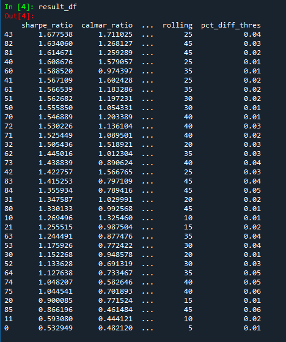
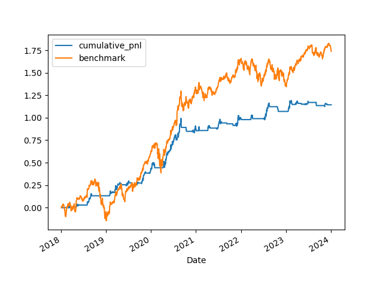
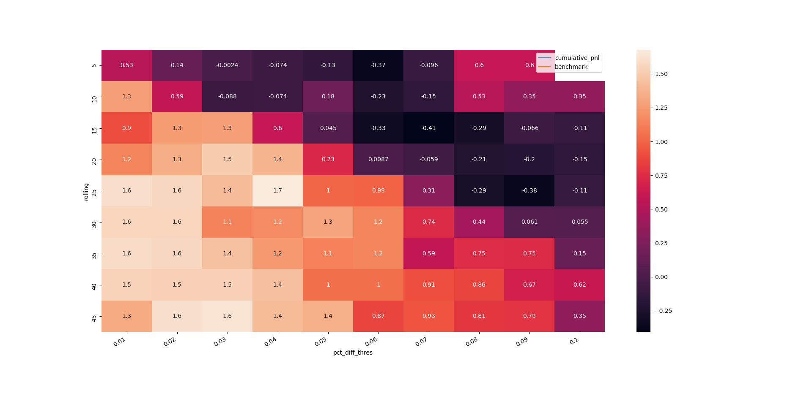

# AAPL Backtest Analysis Sample

This is a data analytics project aimed at backtesting a trading strategy for AAPL (Apple Inc.) using Python and Yahoo Finance API historical price data.

## Step 1 - Define the research question

The primary question of this project is to determine the effectiveness and profitability of a trading strategy for AAPL. Specifically, we aim to identify if a strategy based on the moving average difference (MA diff) indicator can generate positive returns.

## Step 2 - Data collection

Historical price data for AAPL is collected from the Yahoo Finance API. The data includes daily stock prices, volume, and other relevant metrics necessary for strategy development and backtesting.

## Step 3 - Clean the data

The collected data is preprocessed and cleaned using Python libraries such as Pandas. Any missing values or outliers are handled appropriately to ensure accurate analysis.

## Step 4 - Analyze the data

The strategy involves calculating the MA diff, which is the difference between two moving averages of AAPL stock prices. We analyze the historical data to determine the optimal parameters for the moving averages, such as period lengths and thresholds for generating buy and sell signals.

## Step 5 - Backtest the strategy

Using the historical data and the calculated MA diff, we simulate the trading strategy by executing buy and sell signals based on predefined rules. We calculate the resulting profits or losses and evaluate the performance of the strategy.

## Step 6 - Evaluate performance metrics

We analyze various performance metrics to assess the effectiveness of the strategy. These metrics may include measures such as profitability, risk-adjusted returns (e.g., Sharpe ratio), maximum drawdown, and other relevant indicators.

## Step 7 - Optimize the strategy

We explore different variations of the strategy by adjusting the parameters, such as moving average period lengths and thresholds. Through iterative testing and optimization, we aim to improve the strategy's performance and identify the best parameter values for maximizing returns. In this example, using 4% above 25 MA diff as a signal can achieve 
a higher Sharpe ratio and a higher Calmar ratio then buy and hold.

## Step 8 - Visualize the results

We visualize the performance of the strategy using charts and graphs. This includes plotting the equity curve, comparing it to a benchmark (e.g., buy and hold strategy), and analyzing other relevant visualizations to gain insights into the strategy's performance.

## Step 9 - Review and refine the strategy

Based on the performance evaluation and visualizations, we review the strategy's strengths and weaknesses. We consider factors such as the Sharpe ratio, drawdowns, and consistency of returns. We refine and adjust the strategy as necessary to improve its effectiveness and viability for real-world trading.

**Note**: This is a sample analysis and does not constitute financial advice. Trading involves risks, and it is recommended to thoroughly test and validate any trading strategy before using it with real money.
